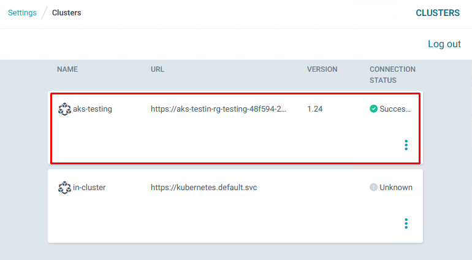

# Argo CD

1. Login into your Azure Account using the Azure CLI and select your subscription
    ```powershell
    az login --tenant TENANT_ID
    az account set -s <subscription-name>
    ```


2. Create the resource group for the ArgoCD AKS

    ```powershell
    az group create --name rg-argocd --location northeurope
    ```
3. Create the AKS \(execute the step 14 to avoid waiting \)
    ```powershell
    az aks create --resource-group rg-argocd --name aks-argocd --node-count 1  --generate-ssh-keys
    ```

4. Connect to the AKS
    ```powershell
    az aks get-credentials --resource-group rg-argocd --name aks-argocd 
    ```
5. Create the namespace for ArgoCD
    ```powershell
    kubectl create namespace argocd
    ```
6. Install ArgoCD
    ```powershell
    kubectl apply -n argocd -f https://raw.githubusercontent.com/argoproj/argo-cd/stable/manifests/install.yaml
    ```
7. Check if all is running
    ```powershell
    kubectl get pods -n argocd
    ```
    
8. Publish the service using a load balancer (it depends on your infrastructure)
   - Edit the argocd-server service and set type to "LoadBalancer"
    ```powershell
    kubectl edit svc/argocd-server -n argocd
    ```
    

9.  Get the public IP
    ```powershell
    kubectl describe service argocd-server -n argocd
    ```
    
10.  Get ArgoCD password encoded in base64
        ```powershell
        kubectl -n argocd get secret argocd-initial-admin-secret -o jsonpath="{.data.password}"
        ```
11. Get the password in plain text
    ```powershell
    kubectl -n argocd get secret argocd-initial-admin-secret -o jsonpath="{.data.password}" | base64 -d
    ```
12.  Access to the ArgoCD server with the IP obtained in step 9

13. Add the repository to ArgoCD
    1.  Go to settings &rarr; Repositories   


    1.  Connect repo (use the private key created in git preparation)   
  

    1.  Check the connection  


14. Create the AKS for the app deployment.
    ```powershell
    az group create --name rg-testing --location northeurope
    az aks create --resource-group rg-testing --name aks-testing --node-count 1 --generate-ssh-keys
    az aks get-credentials --resource-group rg-testing --name aks-testing  
    ```
15. Login ArgoCD and add the testing AKS
    
    ```powershell
    argocd login <ip-address>
    argocd cluster add aks-testing
    ```
    

16. Create the apps for all environments (3 times)   
  
  
    

    Command
    ```powershell
    argocd app create demo-app-<env> --repo <repo-url> --path cluster/namespaces/demo-app --dest-namespace=<environment> --directory-recurse --sync-option CreateNamespace=true --sync-policy automated --dest-server <AKS cluster url> --revision <branch>
    ```