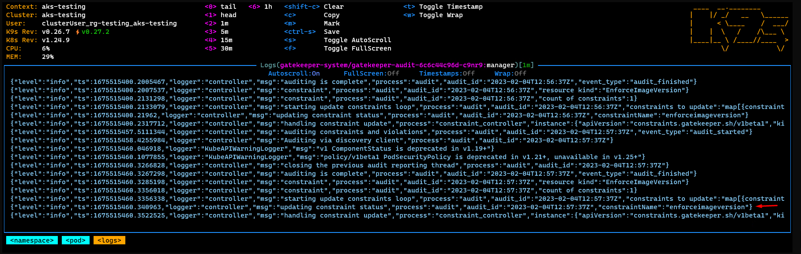
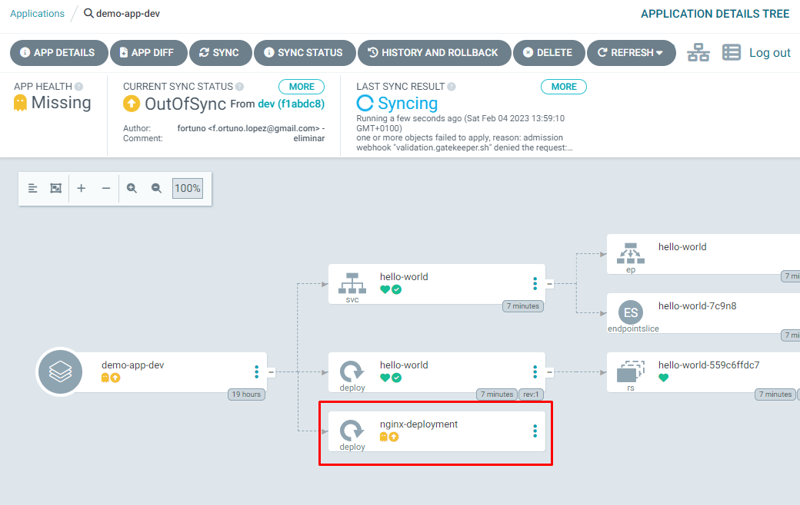

# OPA Gatekeeper configuration

1. Install OPA Gatekeeper in aks-testing

    ```powershell
    wget https://raw.githubusercontent.com/open-policy-agent/gatekeeper/master/deploy/gatekeeper.yaml -o cluster/global/gatekeeper-system/gatekeeper.yaml
    ```
2. Download a policy example and extract into cluster\global\policies (Enforce image version)
   
    [policies.zip](resources/policies.zip)

3. Upload to git
    ```powershell
    git add .
    git commit -m "OPA Gatekeeper and policy example"
    git push
    ```

4. Create ArgoCD app for OPA Gatekeeper deployment
    ```powershell
    argocd app create opa-aks-testing --repo <repository> --dest-namespace gatekeeper-system --path cluster/global/gatekeeper-system --revision production --sync-policy automated --sync-option CreateNamespace=true --dest-server <AKS cluster url>
    ```

5. Create ArgoCD app for policy deployment
    ```powershell
    argocd app create policies-aks-testing --repo <repository> --path cluster/global/policies --revision production --sync-policy automated --directory-recurse --dest-server <AKS cluster url>
    ```

6. Violation test
   1. Create the file into cluster\namespaces\demo-app and upload to git

      ```yaml
      apiVersion: apps/v1
      kind: Deployment
      metadata:
        name: nginx-deployment
        labels:
          app: nginx
      spec:
        replicas: 3
        selector:
          matchLabels:
            app: nginx
        template:
          metadata:
            labels:
              app: nginx
          spec:
            containers:
            - name: nginx
              image: nginx:latest
              ports:
              - containerPort: 80
      ```
    2. Check logs
    
    


7. Delete the test file and upload to GIT


[OPA Gatekeeper policies repository](https://github.com/open-policy-agent/gatekeeper-library)


8. Delete the test AKS and the apps in ArgoCD (we won't use any more)
