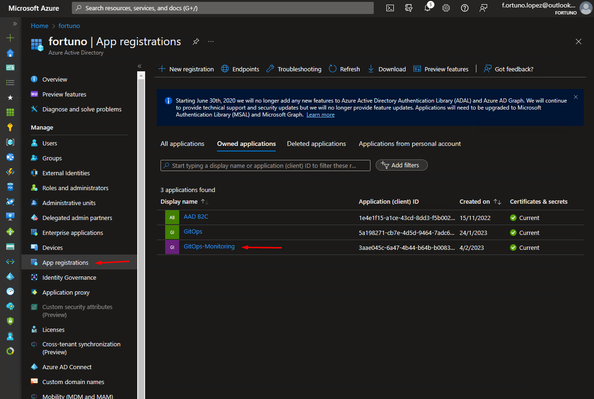
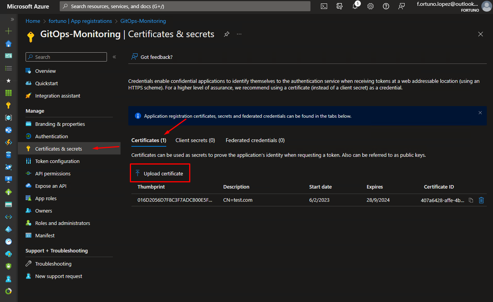
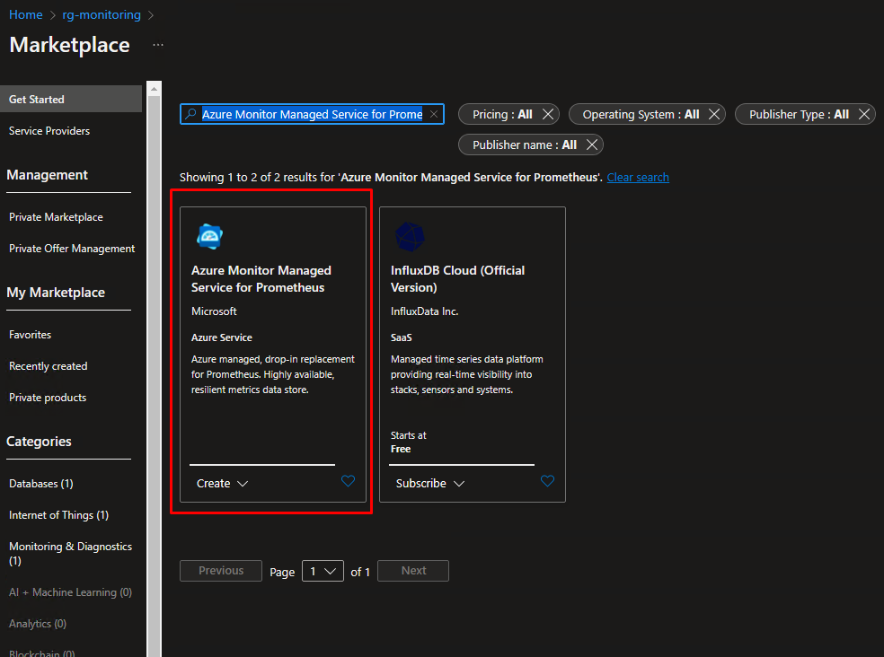
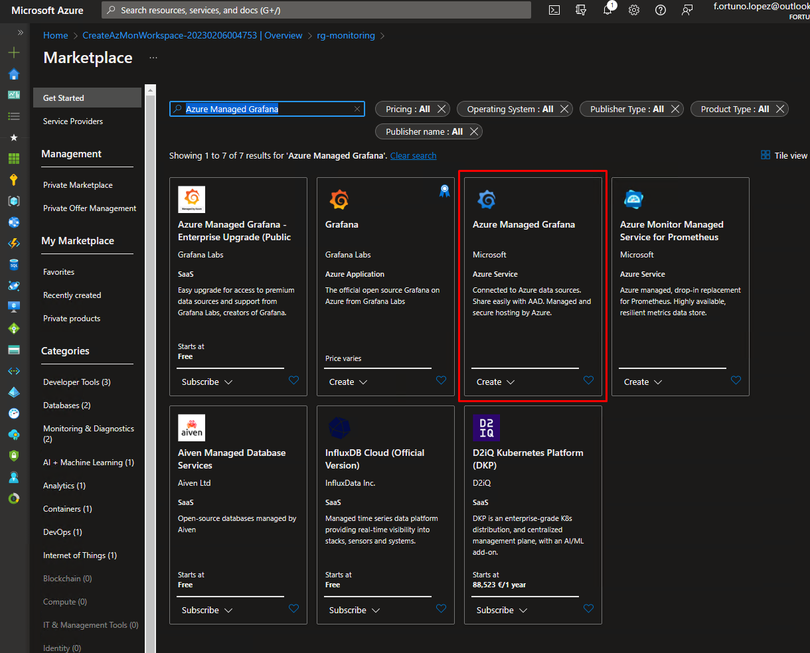
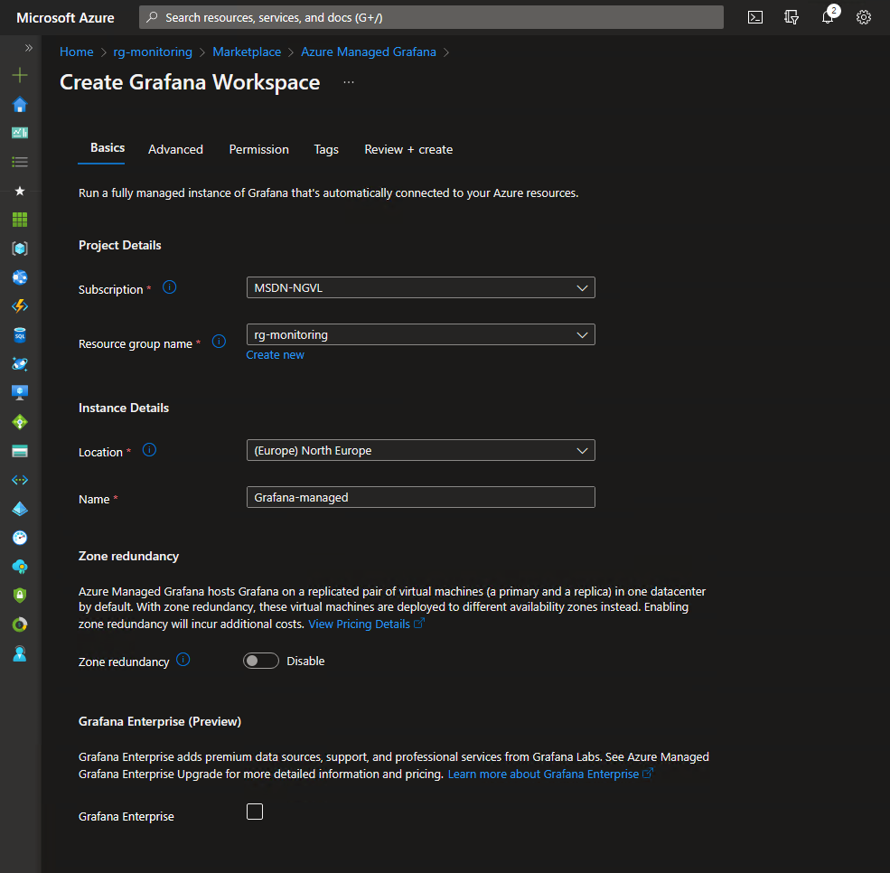
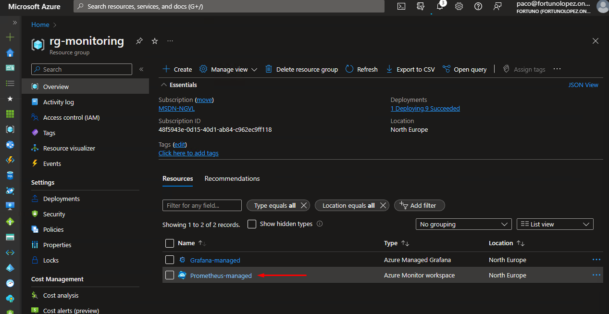
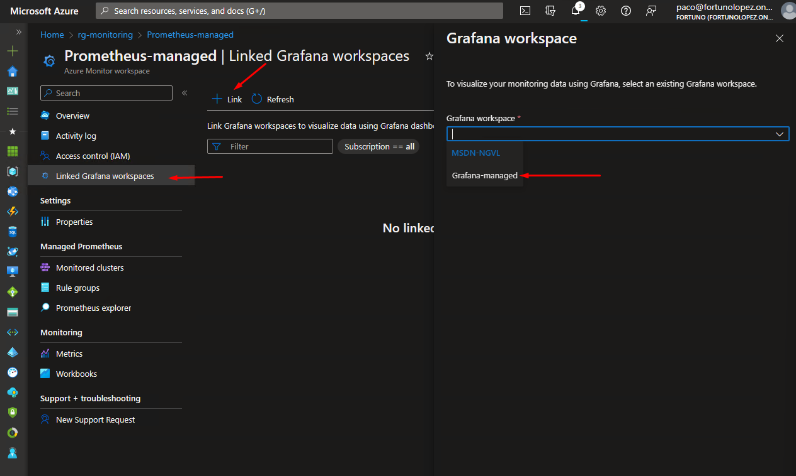
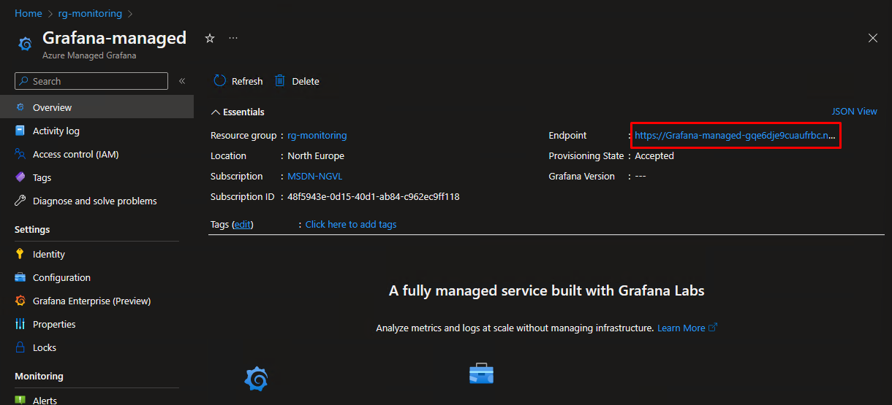

# Monitoring

1. Create the SPN to use in metrics plublish
   ```powershell
   az ad sp create-for-rbac --name "GitOps-Monitoring" --role "Monitoring Metrics Publisher" --scopes /subscriptions/<subscription-id> 
   ```

2. Create a resource group for monitoring
   ```powershell
   az group create --name rg-monitoring --location northeurope
   ```

3. Generate the certificate for the SPN
   ```powershell
   mkdir cert
   cd cert
   openssl req -x509 -newkey rsa:4096 -sha256 -keyout my.key -out my.crt -subj "/CN=test.com" -days 600
   openssl pkcs12 -export -name “test.com” -out my.pfx -inkey my.key -in my.crt
   base64 -n 0 .\my.pfx > output.txt
   ```


4. Upload the certificate to the Azure AD application   

      
      


5. Deploy Prometheus and Grafana in Azure
   1. In [Azure](https://portal.azure.com) in to Resource Group rg-monitoring create a resource "Azure Monitor Managed Service for Prometheus"  

        

   2. In [Azure](https://portal.azure.com) in to Resource Group rg-monitoring create a resource "Azure Managed Grafana"  

        

        


6. Connect Grafana and Prometheus  
   
     

      

7. Access to grafana  

   

8. Create the Secret manifest for the certificate management in cluster\namespaces\prometheus\secret\secret.yaml  
   ```powershell
   mkdir -p cluster\namespaces\prometheus\secret
   ```

   ```yaml
   apiVersion: v1
   kind: Secret
   metadata:
      name: secret-monitoring  

   data:
      monitoring.pfx: <output.txt content>
   ```

9. Upload the files to GIT  
   ```powershell
   git add .
   git commit -m "Monitoring configuration"
   git push
   ```
