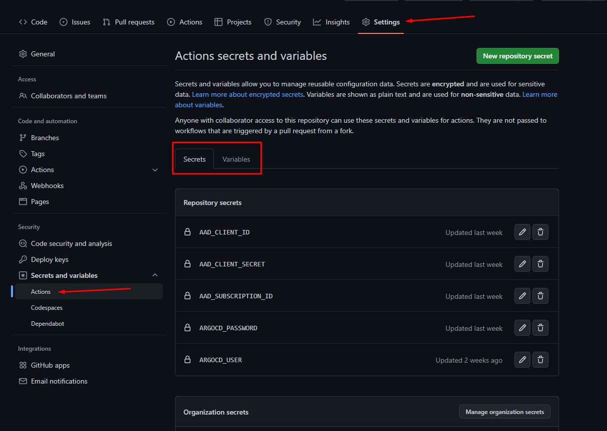
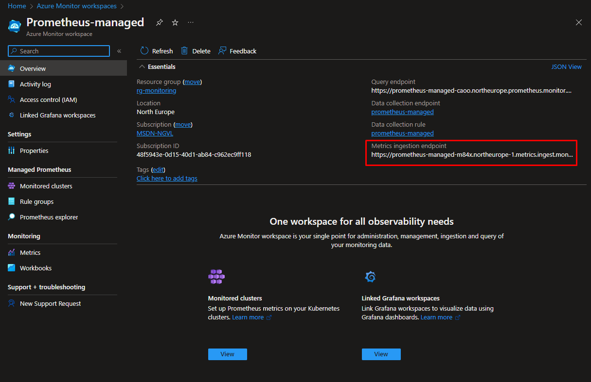
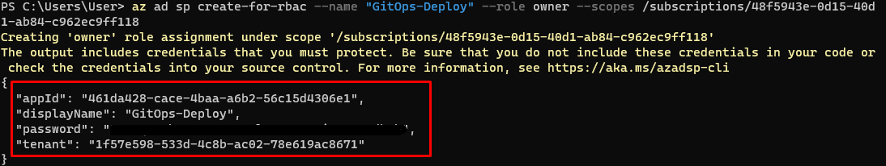
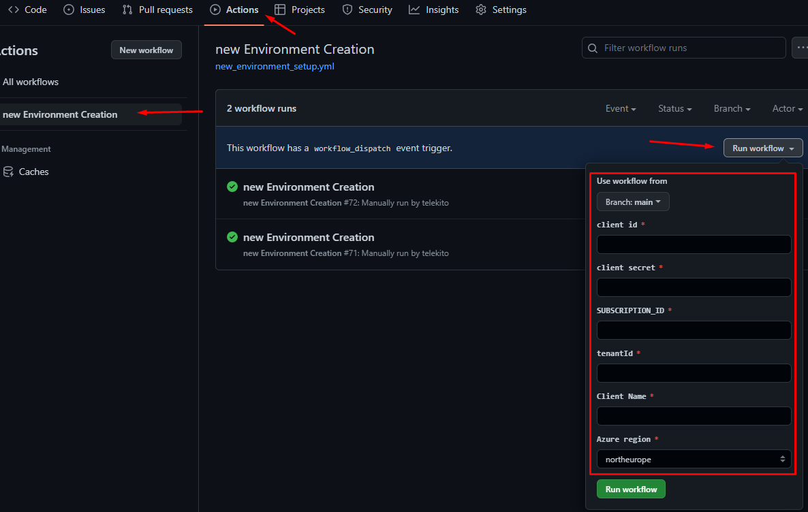

# Pipeline

1. Create a folder for the pipeline
    ```powershell
    mkdir -p .github/workflows
    ```

2. Create the configuration file for Prometheus in cluster\namespaces\prometheus\prometheus-config.yaml

    ```yaml
    prometheus:
      prometheusSpec:
        cluster: <CLUSTER-NAME>   
        externalLabels: {
          cluster: "<CLUSTER-NAME>"
        }   
        remoteWrite:
          - url: http://localhost:8081/api/v1/write           
        volumes:
          - name: secrets-store-inline
            secret:
              secretName: secret-monitoring    
        containers:
          - name: prom-remotewrite
            image: mcr.microsoft.com/azuremonitor/prometheus/promdev/prom-remotewrite:prom-remotewrite-20221103.1
            imagePullPolicy: Always        
            volumeMounts:
              - name: secrets-store-inline
                mountPath: /mnt/secrets-store
                readOnly: true        
            ports:
              - name: rw-port
                containerPort: 8081
            livenessProbe:
              httpGet:
                path: /health
                port: rw-port            
            readinessProbe:
              httpGet:
                path: /ready
                port: rw-port            
            env:
              - name: INGESTION_URL
                value: '<INGESTION_URL>'
              - name: LISTENING_PORT
                value: '8081'
              - name: IDENTITY_TYPE
                value: aadApplication
              - name: AZURE_CLIENT_ID
                value: '<APP-REGISTRATION-CLIENT-ID>'
              - name: AZURE_TENANT_ID
                value: '<TENANT-ID>'
              - name: AZURE_CLIENT_CERTIFICATE_PATH
                value: /mnt/secrets-store/monitoring.pfx
              - name: CLUSTER
                value: '<CLUSTER-NAME>'
    ```

3. Create the workflow file: new_environment_creation.yaml  

    ```yaml
    name: new Environment Creation
    on:
      workflow_dispatch:
        inputs:
          CLIENT_ID:
            description: 'client id'
            required: true
            type: string        
          CLIENT_SECRET:
            description: 'client secret'
            required: true 
            type: string 
          SUBSCRIPTION_ID:
            description: 'SUBSCRIPTION_ID'
            required: true 
            type: string  
          TENANT_ID:
            description: 'tenantId'
            required: true 
            type: string
          clientName:
            description: 'Client Name'
            type: string
            required: true 
          AzureRegion:
            description: 'Azure region'
            required: true
            default: 'northeurope' 
            type: choice
            options:
            - eastus               
            - eastus2              
            - southcentralus       
            - westus2              
            - westus3              
            - australiaeast        
            - southeastasia        
            - northeurope          
            - swedencentral        
            - uksouth              
            - westeurope           
            - centralus            
            - southafricanorth     
            - centralindia         
            - eastasia             
            - japaneast            
            - koreacentral         
            - canadacentral        
            - francecentral        
            - germanywestcentral   
            - norwayeast           
            - switzerlandnorth     
            - uaenorth             
            - brazilsouth          
            - eastus2euap          
            - qatarcentral         
            - centralusstage       
            - eastusstage          
            - eastus2stage         
            - northcentralusstage  
            - southcentralusstage  
            - westusstage          
            - westus2stage         
            - asia                 
            - asiapacific          
            - australia            
            - brazil               
            - canada               
            - europe               
            - france               
            - germany              
            - global               
            - india                
            - japan                
            - korea                
            - norway               
            - singapore            
            - southafrica          
            - switzerland          
            - uae                  
            - uk                   
            - unitedstates         
            - unitedstateseuap     
            - eastasiastage        
            - southeastasiastage   
            - eastusstg            
            - northcentralus       
            - westus               
            - jioindiawest         
            - centraluseuap        
            - westcentralus        
            - southafricawest      
            - australiacentral     
            - australiacentral2    
            - australiasoutheast   
            - japanwest            
            - jioindiacentral      
            - koreasouth           
            - southindia           
            - westindia            
            - canadaeast           
            - francesouth          
            - germanynorth         
            - norwaywest           
            - switzerlandwest      
            - ukwest               
            - uaecentral           
            - brazilsoutheast       

    env:
      AZURE_CREDENTIALS_CLIENT: '{"clientId":"${{ inputs.CLIENT_ID }}","clientSecret":"${{ inputs.CLIENT_SECRET }}","subscriptionId":"${{ inputs.SUBSCRIPTION_ID }}","tenantId":"${{ inputs.TENANT_ID }}"}'     

    jobs:  
      create-aks:    
        runs-on: ubuntu-latest        
        steps:      
          - uses: Azure/login@v1
            with:
              creds: ${{ env.AZURE_CREDENTIALS_CLIENT }}
          - name: Create resource group rg-${{ inputs.clientName }}
            uses: azure/CLI@v1
            with:
              azcliversion: 2.44.1
              inlineScript: |
                az group create --name rg-${{ inputs.clientName }} --location ${{ inputs.AzureRegion }}              
          - name: Create aks aks-${{ inputs.clientName }}
            uses: azure/CLI@v1          
            with:            
              azcliversion: 2.44.1
              inlineScript: |              
                az aks create --resource-group rg-${{ inputs.clientName }} \
                  --name aks-${{ inputs.clientName }} \
                  --node-count 1 \
                  --generate-ssh-keys

      create-argocd-cluster: 
        needs: create-aks
        runs-on: ubuntu-latest
        steps:    
          - uses: Azure/login@v1
            with:
              creds: ${{ env.AZURE_CREDENTIALS_CLIENT }}                
          - name: Login into the AKS
            uses: azure/aks-set-context@v3
            with:
              resource-group: 'rg-${{ inputs.clientName }}'
              cluster-name: 'aks-${{ inputs.clientName }}'
          - name: Setup App ArgoCD CLI 
            uses: azure/CLI@v1
            with:     
              azcliversion: 2.44.1                   
              inlineScript: |              
                curl -sSL -o /usr/local/bin/argocd https://github.com/argoproj/argo-cd/releases/latest/download/argocd-linux-amd64
                chmod +x /usr/local/bin/argocd  
                argocd login ${{ vars.ARGOCD_SERVER }} --username ${{ secrets.ARGOCD_USER }} --password ${{ secrets.ARGOCD_PASSWORD }} --insecure
                argocd cluster add aks-${{ inputs.clientName }} --insecure true -y

      create-argocd-app: 
        needs: create-argocd-cluster
        runs-on: ubuntu-latest
        steps:
          - name: Setup App ArgoCD CLI 
            uses: azure/CLI@v1
            with:     
              azcliversion: 2.44.1                   
              inlineScript: |              
                curl -sSL -o /usr/local/bin/argocd https://github.com/argoproj/argo-cd/releases/latest/download/argocd-linux-amd64
                chmod +x /usr/local/bin/argocd  
                argocd login ${{ vars.ARGOCD_SERVER }} --username ${{ secrets.ARGOCD_USER }} --password ${{ secrets.ARGOCD_PASSWORD }} --insecure            
                argocd app create app-${{ inputs.clientName }} \
                  --repo ${{ vars.GIT_REPOSITORY }} \
                  --path cluster/namespaces/demo-app \
                  --dest-namespace=demo-app \
                  --directory-recurse \
                  --sync-option CreateNamespace=true \
                  --sync-policy automated \
                  --dest-server $(argocd cluster get aks-${{ inputs.clientName }} -o json | jq -r '.server')
      opa-gatekeeper-app: 
        needs: create-argocd-cluster
        runs-on: ubuntu-latest
        steps:
          - name: Setup App ArgoCD CLI 
            run: |             
                curl -sSL -o /usr/local/bin/argocd https://github.com/argoproj/argo-cd/releases/latest/download/argocd-linux-amd64
                chmod +x /usr/local/bin/argocd  
                argocd login ${{ vars.ARGOCD_SERVER }} --username ${{ secrets.ARGOCD_USER }} --password ${{ secrets.ARGOCD_PASSWORD }} --insecure
          - name: Create OPA APP
            run: |  
                argocd app create opa-${{ inputs.clientName }} --repo ${{ vars.GIT_REPOSITORY }} --path cluster/global/gatekeeper-system --dest-namespace=gatekeeper-system --sync-option CreateNamespace=true --sync-policy automated --dest-server $(argocd cluster get aks-${{ inputs.clientName }} -o json | jq -r '.server')
          - name: Create POLICY APP
            run: |              
                argocd app create policies-${{ inputs.clientName }} --repo ${{ vars.GIT_REPOSITORY }} --path cluster/global/policies --directory-recurse --sync-policy automated --dest-server $(argocd cluster get aks-${{ inputs.clientName }} -o json | jq -r '.server')

      configure-prometheus: 
        needs: create-argocd-cluster
        runs-on: ubuntu-latest
        steps:    
          - uses: actions/checkout@master
          - uses: Azure/login@v1
            with:
              creds: ${{ env.AZURE_CREDENTIALS_CLIENT }}
          - name: Login into the AKS
            uses: azure/aks-set-context@v3
            with:
              resource-group: 'rg-${{ inputs.clientName }}'
              cluster-name: 'aks-${{ inputs.clientName }}'
          - name: Install HELM
            uses: azure/setup-helm@v3
            with:
              version: 'v3.11.0'
          - name: Setup prometheus configuration file
            run: |
              sed -i 's,<CLUSTER-NAME>,aks-${{ inputs.clientName }},g' cluster/namespaces/prometheus/prometheus-config.yaml
              sed -i 's,<INGESTION_URL>,${{ vars.PROMETHEUS_INGESTION_URL }},g' cluster/namespaces/prometheus/prometheus-config.yaml
              sed -i 's,<APP-REGISTRATION-CLIENT-ID>,${{ vars.PROMETHEUS_CLIENT_ID }},g' cluster/namespaces/prometheus/prometheus-config.yaml
              sed -i 's,<TENANT-ID>,${{ vars.TENANT_ID }},g' cluster/namespaces/prometheus/prometheus-config.yaml

          - name: Create the app to manage the secret 
            uses: azure/CLI@v1
            with:     
              azcliversion: 2.44.1                   
              inlineScript: |              
                curl -sSL -o /usr/local/bin/argocd https://github.com/argoproj/argo-cd/releases/latest/download/argocd-linux-amd64
                chmod +x /usr/local/bin/argocd  
                argocd login ${{ vars.ARGOCD_SERVER }} --username ${{ secrets.ARGOCD_USER }} --password ${{ secrets.ARGOCD_PASSWORD }} --insecure
                argocd app create secret-monitoring-${{ inputs.clientName }} \
                  --repo ${{ vars.GIT_REPOSITORY }} \
                  --path cluster/namespaces/prometheus/secret \
                  --dest-namespace=prometheus \
                  --directory-recurse \
                  --sync-option CreateNamespace=true \
                  --sync-policy automated \
                  --dest-server $(argocd cluster get aks-${{ inputs.clientName }} -o json | jq -r '.server')
          - name: install prometheus
            run: |
              helm repo add prometheus-community https://prometheus-community.github.io/helm-charts
              helm repo update
              helm install prometheus \
                prometheus-community/kube-prometheus-stack \
                --namespace prometheus \
                --create-namespace

          - name: Disable unused metrics
            run: |
              helm upgrade prometheus \
                  prometheus-community/kube-prometheus-stack \
                  --namespace prometheus \
                  --set kubeEtcd.enabled=false \
                  --set kubeControllerManager.enabled=false \
                  --set kubeScheduler.enabled=false
          - name: Apply configuration
            run: |
              helm upgrade prometheus \
                  prometheus-community/kube-prometheus-stack \
                  --namespace prometheus \
                  -f cluster/namespaces/prometheus/prometheus-config.yaml 
    ```

3. Create the secrets and variables in GitHub Actions:  
     

   - Secrets          
     - ARGOCD_PASSWORD: The password for login into ArgoCD
     - ARGOCD_USER: The user for login into ArgoCD
   - Variables
     - ARGOCD_SERVER: The IP Addres of ArgoCD
     - PROMETHEUS_CLIENT_ID: App identifier for prometheus metrics
     - PROMETHEUS_INGESTION_URL: Prometheus endpoint  
  

     - TENANT_ID: Azure AD tenant that Prometheus is located
     - GIT_REPOSITORY: Our repository (ssh url)

4. Upload the workflow to GIT
   
    ```powershell
    git add .
    git commit -m "Pipeline preparation"
    git push
    ```

5. Run the pipeline:
   1. We should have a SPN that has owner permissions in the subscription:
      1. Run in the destination subscription
            ```powershell
            az ad sp create-for-rbac --name "GitOps-Deploy" --role owner --scopes /subscriptions/<subscription-id> 
            ```  
              
      We need this values for the pipeline execution  
      2. Go to the pipeline and complete the form with the values  
        
      3. When the execution finalized we will have a new environment running and the metrics should be sent to our Managed Prometheus

6. Review the Apps in ArgoCD
7. Review the metrics in Grafana


