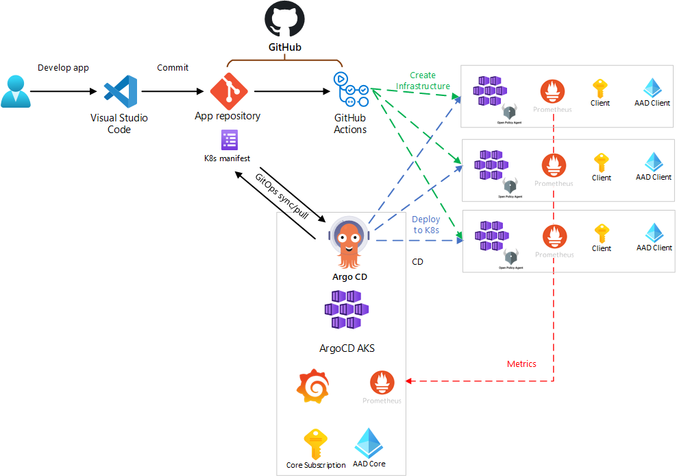

# GitOps Hands On Lab

# Architecture diagram

# Guide

0. [Software](0-LocalConfig/README.md)
1. [GIT](1-Git/README.md)
2. [ArgoCD](2-ArgoCD/README.md)
3. [OPA Gatekeeper](3-OPA%20Gatekeeper/README.md)
4. [Monitoring (Grafana & Prometheus)](4-Monitoring/README.md)
5. [Pipeline](5-Pipeline/README.md)

